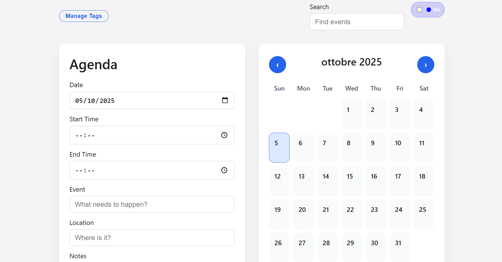
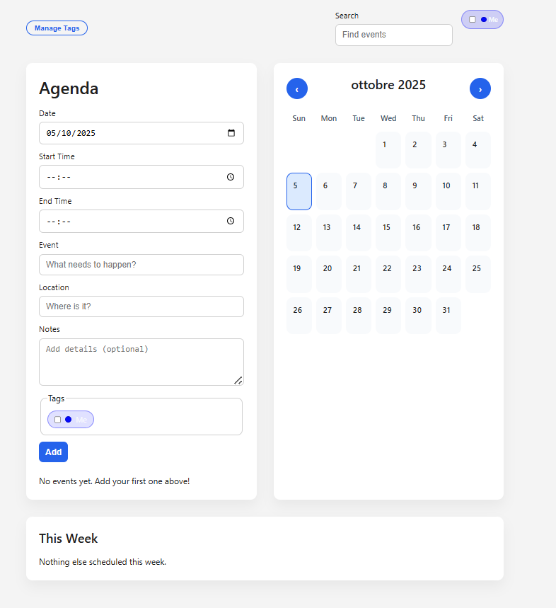

# Agenda App

Applicazione web single-page per pianificare eventi quotidiani, visualizzarli in un'agenda filtrabile e mantenere il controllo del calendario settimanale e mensile. Tutto è salvato in locale, senza dipendenze da backend, così da poter usare il tool offline o integrarlo in un progetto esistente.

## Screenshot

## Funzionalità principali
- Creazione e modifica di eventi con data, fascia oraria, luogo, note e tag colorati
- Vista agenda ordinata e filtro testuale per trovare rapidamente un'attività
- Widget "This Week" per avere sempre sotto controllo gli impegni a breve termine
- Calendario mensile interattivo con badge numerici e modale di dettaglio per ciascun giorno
- Gestione avanzata dei tag (creazione, assegnazione, cancellazione) con colori personalizzati
- Persistenza automatica su `localStorage` per eventi, filtri e tag
- Notifiche toast contestuali e supporto da tastiera (ESC per chiudere modali, navigazione sui badge)

## Stack e dipendenze
- HTML5 semantico per struttura e accessibilità
- CSS3 moderno (layout responsive a griglia, color-scheme light/dark)
- JavaScript vanilla per logica, gestione stato e interazione con `localStorage`

## Avvio rapido
1. Clona o scarica questo repository sul tuo computer.
2. Apri `index.html` direttamente nel browser **oppure** avvia un semplice server statico:
   - `python -m http.server 8000`
   - `npx serve .`
3. Visita l'indirizzo locale indicato (ad es. `http://localhost:8000`) per utilizzare l'app.

## Struttura del progetto
- `index.html` – layout principale con form agenda, calendario, drawer tag e modale giornaliera
- `styles.css` – stile responsive con grid layout, badge, toast e drawer animato
- `app.js` – state management, rendering dinamico, filtri, gestione tag, salvataggio dati

## Dettagli implementativi
- Gli eventi sono memorizzati con chiavi `agenda-events`, `agenda-tags` e `agenda-filters` su `localStorage`
- Le funzioni di rendering aggiornano agenda, calendario e vista settimanale in modo coerente
- Il drawer per i tag utilizza overlay e controlli ARIA (`aria-hidden`, `aria-live`) per migliorare accessibilità
- I badge numerici nel calendario aprono un modale con focus gestito e ritorno al giorno di origine

## Personalizzazione
- Modifica `DEFAULT_TAG_COLOR` in `app.js` per cambiare il colore predefinito dei tag
- Aggiorna le variabili CSS in `styles.css` per adattare palette e tipografia
- Estendi `renderAgenda` o `renderUpcomingWeek` per integrare nuove viste (es. esportazione, stampa)

## Roadmap suggerita
- Sincronizzazione opzionale con backend o servizi di calendario esterni
- Supporto drag & drop per spostare eventi
- Esportazione in CSV/ICS e condivisione
- Tema scuro/chiaro gestibile dall'interfaccia utente

## Changelog
Consulta [`CHANGELOG.md`](CHANGELOG.md) per lo storico dettagliato delle versioni.

## Contributi
Le linee guida per bug report, proposte e pull request sono descritte in [`CONTRIBUTING.md`](CONTRIBUTING.md). Se stai iniziando, controlla prima la sezione *Come posso aiutare?* e apri una issue per coordinare il lavoro.

## Licenza
Questo progetto è distribuito nel rispetto della licenza [MIT](LICENSE).
